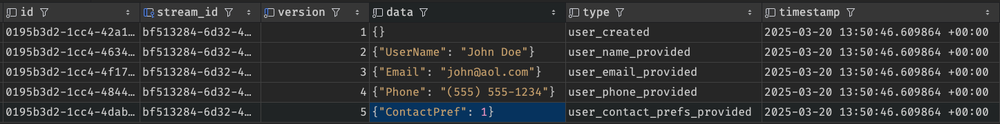

import { Steps } from '@astrojs/starlight/components';
import Brain from '../../../../components/Brain.astro';

import { FileTree } from '@astrojs/starlight/components';

Open your new solution in your IDE of choice. 


We can delete the `UnitTest1.cs` file in the `HelpDesk.Tests` project.

## Event Sourcing 101

We are going to take an *incremental* approach to building our system. We are going to start with a simple event, and then build on that.

I don't want to give *too much* confusing context yet, but we are going to start with modeling the notion of a user in our system. My *habitual* take would be to start 
thinking about what kind of *data* and *behavior* we'd want a user in our system to have.  With Event Sourcing, we are going to do this differently.

We are going to start with the kind of things that happen to a user over time in our system. 

:::tip[Defining Events] 
An **event** is something that happens in the past. It is a record of something that has already happened. 
Think "I went to this really cool restaurant last week" not "I am going
to this really cool restaurant next week". As a convention, we will use the past tense for our event names. For example `RestaurantVisited`.
:::

### Our Scenario

As you might have guessed, we are going to be building a help desk system. As Jeremy Miller (founder of JasperFx) says "Demo Code is Hard". 
Our goal here is **not** to build some kind of "reference app", it is to help you learn the Critter Stack and start thinking about how to build applications with it.

### <Brain /> Developer Brain 
I know, as a *professional* software developer, managing identity in a system is complex. Let's say what we have decided is that we will use an external identity provider 
that implements the OAuth2 protocol with OIDC. A "User" in our system is someone that has had their identity verified by that provider. Perhaps we will use JSON Web Tokens
to verify that the user is who they say they are, and their "stable" identity will be represented in the `sub` claim on the JWT.

Blah. Blah Blah. We will get there, I promise. But what I want to encourage you to do is to start with the *important* things that actually have something to do with our application.

## Thinking In Events

What are the *important* things that happen to a user in our system? What are the *important* things that we need to know about a user in our system?

Well, our users will *eventually* use our system to tell us about problems they are having with some software we provide them. 
When they do, one of our "support techs" will be assigned to help them, and they will be able to communicate with them about the problem.

So the user will have to do some stuff to get us to that point.

- They will have to be recorded as a user in our system somehow.
- They will have to tell us their name, phone number and/or email address, and tell us how they prefer to be contacted.

In other words, we can't do *anything* to help a user until the user does the following things:

- They are **Created** - A user is created in our system. This is the first thing that happens to a user in our system.
- They **Provides a User Name** - A user can give us a name they'd like to be called in any communications with us. 
- They **Provides an Email Address** - A user can give us an email address to send them information about their account.
- They **Provides a Phone Number** - A user can give us an email address to send them information about their account.
- **Tells us their preference for being contacted** - A user can tell us how they would like to be contacted, either by email or by phone.

## Writing Tests

<Steps>
1. Create a new Test Class
    In the `HelpDesk.Tests` project, create a new directory called `Users`, and in that, a new file called `Onboarding.cs`.
    ```csharp
    namespace HelpDesk.Tests.Users;

    public class Onboarding
    {

    }
    ```
2. Add Some Code to Represent These Events
    *Above* the class `OnBoarding` in the `Onboarding.cs` file, add the following code:
    ```csharp
    public record UserCreated;
    public record UserNameProvided(string UserName);
    public record UserEmailProvided(string Email);
    public record UserPhoneProvided(string Phone);
    public enum UserContactPrefs { Phone, Email}
    public record UserContactPrefsProvided(UserContactPrefs ContactPref);
    ```
    :::note
    You don't *have* to use records, but I dig them for this. I mean events are *literally* a record of something that happened, right?
    :::
3. Let's Start with the "Happy Path"
    We will start with the low-hanging fruit. A new user is created, they provide *all the things*.

    In the `OnBoarding` class, add the following code:
    ```csharp
    [Fact]
    public async Task HappyPath()
    {
        var created = new UserCreated();
        var nameProvided = new UserNameProvided("John Doe");
        var emailProvided = new UserEmailProvided("john@aol.com");
        var phoneProvided = new UserPhoneProvided("(555) 555-1234");
        var contactPrefsProvided = new UserContactPrefsProvided(UserContactPrefs.Email);
        
        // Uh, what to assert on?
    }
    ```
    
</Steps>

### What to Assert On?

This is a bit silly, right? I mean we could write some *shallow* tests here for each of these events, but there really isn't any logic. 
Would it really give me any more confidence if I wrote a test like this?

```csharp title="Don't do this - just a demo"

[Fact]
public void UserNameEventHasAName()
{
    var nameProvided = new UserNameProvided("John Doe");
    Assert.Equal("John Doe", nameProvided.UserName);
}
```

Congratulations! You just tested whether .NET can, uh, store a variable in memory. 

### Event Streams

:::tip[Definition - Event Streams]
An **event stream** is a collection of events that are related to each other in some way.

A certain series of events happened in relation to a certain "thing" in our system. 
The term "Event Stream" is a conventional term used in Event Sourcing systems. Other tools, like Kafka, use the term "Topic" to refer to a similar concept.
Strangely, Kafka isn't an event sourcing system, but it is a messaging system that is often used in event sourcing systems.

But I'll admit, I like to substitute the word "Topic" for "Stream" in my head.

Either way, "Stream" is a powerful metaphor. A stream "flows" over time. Our code here can be a little confusing because it's basically *synchronous*. We create the user, we provide their name, etc.
But in reality these things might have gaps between them. I create an account on your website, and *later* I go fill out my profile.

:::

In the Critter Stack, we identify a *stream* of related events with some kind of identifier. You have some options here, but for our purposes, we are going to use 
a `Guid` to identify our stream. 

We need some way to associate all these events with a particular user, but there is no "user". There are only a series of events that 
are related in some way.

And we need to *store* these events in a database. We are going to use Marten to do that.

Update your `Onboarding.cs` file to look like this:

```csharp ins={1, 15-19, 26-28}
using Marten;
namespace HelpDesk.Tests.Users;
public record UserCreated;
public record UserNameProvided(string UserName);
public record UserEmailProvided(string Email);
public record UserPhoneProvided(string Phone);
public enum UserContactPrefs { Phone, Email}
public record UserContactPrefsProvided(UserContactPrefs ContactPref);

public class Onboarding
{
    [Fact]
    public async Task HappyPath()
    {
        var store = DocumentStore.For(config =>
        {
            config.Connection("host=localhost;database=issues;password=password;username=user");
        });
        await using var session =  store.LightweightSession();
        var created = new UserCreated();
        var nameProvided = new UserNameProvided("John Doe");
        var emailProvided = new UserEmailProvided("john@aol.com");
        var phoneProvided = new UserPhoneProvided("(555) 555-1234");
        var contactPrefsProvided = new UserContactPrefsProvided(UserContactPrefs.Email);
        
        var userStreamId = Guid.NewGuid();
        session.Events.StartStream(userStreamId, created, nameProvided, emailProvided, phoneProvided, contactPrefsProvided);
        await session.SaveChangesAsync();
        // Uh, what to assert on?
    }
}
```

We still aren't asserting on anything, but we are at least storing the events in a database.

:::tip[Wait - What Database?]
If and when we need it, we have *complete* control over almost every aspect of the database. But Marten will, by default, create some database schema for us.

Our connection on the `DocumentStore` is a connection string to a PostgreSQL database we started in our container.
:::

Marten stores the events in a table called `mt_events`. After running this test, it looks like this:



Each event is *logged* with a unique Identifier, a timestamp, the data of the event, the type, and the stream id.

It also stores a version number, incrementing it each time an event is published to that particular stream. We'll look at how that can be handy later.

### Back to What to Assert On

We *could* write some code that queries that `mt-events` table to see if the events are there, but that isn't a very "business facing" test.

What if we wanted to test that for this stream of events, which *represents* the concept of a User, we can see what their information is based on this stream of events?

### Projections

In event sourcing, we don't really keep the "state" of a "thing" in the database, but by peering into the stream of related events, we can create
different lenses through which to interpret those events.

We can do that with a *projection*. A projection is a way to take the raw events and turn them into something that is more useful for us.

"Databases" are for storing data, and for answering questions. The *historic* problem is that defining a database that let's you efficiently store data, 
*and* answer questions is hard. Especially when the data you store and the questions you need answered change all the time.

A core idea behind event sourcing is that you store *what has happened*, and you use that to answer questions.
You can think of a projection as a way to "project" the data in the event stream into a different shape.

<Steps>
1. At the top of your `Onboarding.cs` file, add the following code:
    ```csharp
    public record User(UserCreated create)
    {
        public Guid Id { get; init; }
        public string Name { get; init; } = string.Empty;
        public string Email { get; init; } = string.Empty;
        public string Phone { get; init; } = string.Empty;
        public UserContactPrefs? ContactPreference { get; init; }
    }
    ```
    This is just a simple record (could be a class, if you prefer), with a few properties and a constructor that requires an instance of `UserCreated`.
2. Replace the `// Uh, what to assert on?` comment with the following code:
    ```csharp
    var user = await session.Events.AggregateStreamAsync<User>(userStreamId);
    Assert.NotNull(user);
    Assert.Equal(user.Id, user.Id);
    Assert.Equal("", user.Name);
    Assert.Equal("", user.Email);
    Assert.Equal("", user.Phone);
    Assert.Null(user.ContactPreference);
    ```
</Steps>

<details>
<summary>Click to see the full code</summary>

```csharp
using Marten;
namespace HelpDesk.Tests.Users;
public record UserCreated;
public record UserNameProvided(string UserName);
public record UserEmailProvided(string Email);
public record UserPhoneProvided(string Phone);
public enum UserContactPrefs { Phone, Email}
public record UserContactPrefsProvided(UserContactPrefs ContactPref);

public record User(UserCreated create)
{
    public Guid Id { get; init; }
    public string Name { get; init; } = string.Empty;
    public string Email { get; init; } = string.Empty;
    public string Phone { get; init; } = string.Empty;
    public UserContactPrefs? ContactPreference { get; init; }
}

public class Onboarding
{
    [Fact]
    public async Task HappyPath()
    {
        var store = DocumentStore.For(config =>
        {
            config.Connection("host=localhost;database=issues;password=password;username=user");
        });
        await using var session =  store.LightweightSession();
        var created = new UserCreated();
        var nameProvided = new UserNameProvided("John Doe");
        var emailProvided = new UserEmailProvided("john@aol.com");
        var phoneProvided = new UserPhoneProvided("(555) 555-1234");
        var contactPrefsProvided = new UserContactPrefsProvided(UserContactPrefs.Email);
        
        var userStreamId = Guid.NewGuid();
        session.Events.StartStream(userStreamId, created, nameProvided, emailProvided, phoneProvided, contactPrefsProvided);
        await session.SaveChangesAsync();
        
        var user = await session.Events.AggregateStreamAsync<User>(userStreamId);
        Assert.NotNull(user);
        Assert.Equal(user.Id, user.Id);
        Assert.Equal("", user.Name);
        Assert.Equal("", user.Email);
        Assert.Equal("", user.Phone);
        Assert.Null(user.ContactPreference);
    }
}
```
</details>

Pretty cool, huh? That `session.Events.AggregateStreamAsync<User>(userStreamId)` call is what does the work of "projecting" the events into a `User` object.
It will look at the events in the stream, and use the constructor of the `User` class to create a new instance of `User`.

You can see it was able to infer the `Id` property from the stream id, but the other properties are still empty.
We need to tell the Critter Stack how to "apply" the other events we are interested in into the `User` object.

<Steps>
1. First, let's update our assertions to show what we really want:
    ```diff lang="csharp"
        [Fact]
    public async Task HappyPath()
    {
        var store = DocumentStore.For(config =>
        {
            config.Connection("host=localhost;database=issues;password=password;username=user");
        });
        await using var session =  store.LightweightSession();
        var created = new UserCreated();
        var nameProvided = new UserNameProvided("John Doe");
        var emailProvided = new UserEmailProvided("john@aol.com");
        var phoneProvided = new UserPhoneProvided("(555) 555-1234");
        var contactPrefsProvided = new UserContactPrefsProvided(UserContactPrefs.Email);
        
        var userStreamId = Guid.NewGuid();
        session.Events.StartStream(userStreamId, created, nameProvided, emailProvided, phoneProvided, contactPrefsProvided);
        await session.SaveChangesAsync();
        
        var user = await session.Events.AggregateStreamAsync<User>(userStreamId);
        Assert.NotNull(user);
        Assert.Equal(user.Id, user.Id);
    -   Assert.Equal("", user.Name);
    +   Assert.Equal("John Doe", user.Name);
    -   Assert.Equal("", user.Email);
    +   Assert.Equal("john@aol.com", user.Email);
    -   Assert.Equal("", user.Phone);
    +   Assert.Equal("(555) 555-1234", user.Phone);
    -   Assert.Null(user.ContactPreference);
    +   Assert.Equal(UserContactPrefs.Email, user.ContactPreference);
    }
    ```
2. Since I'm using a record as the base for my projection, I can use the `with` expression to create a new instance of the `User` object with the new values for each of the events I'm interested in.
    ```diff lang="csharp"
    public record User(UserCreated create)
    {
        public Guid Id { get; init; }
        public string Name { get; init; } = string.Empty;
        public string Email { get; init; } = string.Empty;
        public string Phone { get; init; } = string.Empty;
        public UserContactPrefs? ContactPreference { get; init; }
        public required DateTimeOffset CreatedOn { get; init; }

    +    public static User Apply(UserNameProvided userNameProvided, User user) =>
    +        user with { Name = userNameProvided.UserName };
    +    public static User Apply(UserEmailProvided userEmailProvided, User user) =>
    +        user with { Email = userEmailProvided.Email };
    +    public static User Apply(UserPhoneProvided userPhoneProvided, User user) =>
    +       user with { Phone = userPhoneProvided.Phone };
    +    public static User Apply(UserContactPrefsProvided userContactPrefsProvided, User user) =>
    +        user with { ContactPreference = userContactPrefsProvided.ContactPref };
    }
    ```
3. Profit!
   At this point your tests should all pass!
</Steps>

Now, when we use the `AggregateStreamAsync<User>(userStreamId)` method, it will look at the events in the stream, and use the constructor of the `User` class to create a new instance of `User`,
and then when, in traversing the series of events on that stream, it will call the `Apply` method for each of the events that are in the stream.

If it should find an event that has nothing to do with the `User` projection, it will just ignore it.
<details>
<summary>**If you are freaked out about the "magic" here, and need some reassurance.**</summary>

Take a deep breath. There is a lot going on here. The problem might be, though, if you actually pause and think about this, it makes sense on a conceptual level, but 
you might have the thought "Wait! How the heck is this working?" and start doing all that "Developer Brain" stuff I mentioned earlier.

It might be a *big ask*, but just consider that we are *borrowing* the "Developer Brain" <Brain /> of the folks that use, maintain, and contribute to the Critter Stack. 
There are a lot of *really* smart people that have put a lot of thought into this, and they have done a lot of the heavy lifting for us.
There are systems using the Critter Stack that process *millions* of events a day. 

So if you have questions like "How does it know to call the `Apply` method?" and "Isn't that slow, going through all the events each time you want to see what is up with a `User`?
Or, "Wait, it must be using *reflection* to figure out how to call the `Apply` method, right? That must be slow! I don't want to use reflection in my code!"

These are all *legitimate questions*, but I want to encourage you to take a step back and think about the *concept* of what we are doing here.

My experience with the Critter Stack is that when I do have these thoughts arise, they are anticipated, and dealt with beautifully. And we will get there.

But I also want to acknowledge that leaving these unanswered for now might be too big of a leap of faith, and you might be tempted to do a table flip, and move on.

So, briefly:

- How does it know to call the `Apply` method? 
  - It doesn't. It looks for a method that matches the signature of `Apply` and calls it. It is not using reflection, but it is using some *magic* (read: compile-time code generation) to do this. 
  - We'll look at how this works later.
- Isn't that slow, going through all the events each time you want to see what is up with a `User`?
    - No. Well, *maybe*. This is just the "default" way to do projections. I almost *always* start with these "inline projections", but we have other options, and we will look at those later, too.
    - Keep in mind, we aren't looking at *all* the events in the system. We are looking at a *stream* of events that are related to a particular "thing" in our system. Databases (here, PostgreSQL) are *really* good at this,
    and it even has some tricks up it's sleeve we'll explore later if performance *does* become a problem.

</details>

### Back to that "Version" Thing

You may recall that Marten stores a "Version" field in the database and it is incremented each time a new event is added to the stream.

We can get that version number in our `User` projection by adding a `Version` property to the `User` class:
```diff lang="csharp"
public record User(UserCreated create)
{
    public Guid Id { get; init; }
    public string Name { get; init; } = string.Empty;
    public string Email { get; init; } = string.Empty;
    public string Phone { get; init; } = string.Empty;
    public UserContactPrefs? ContactPreference { get; init; }
+    public int Version { get; init; }
    // rest left out - we just need the property.
}
```

If we add an `Assert` to ou test, we can see the version number is set to `5`:
```diff lang="csharp"  
    Assert.NotNull(user);
    Assert.Equal(user.Id, user.Id);
    Assert.Equal("John Doe", user.Name);
    Assert.Equal("john@aol.com", user.Email);
    Assert.Equal("(555) 555-1234", user.Phone);
    Assert.Equal(UserContactPrefs.Email, user.ContactPreference);
+   Assert.Equal(5, user.Version);
```

This is because we added 5 events to the stream.

Let's add another event to the stream and recreate the projection.

Let's say the user later decides they want to be contacted by phone instead of email.

Add this to after the asserts in the `HappyPath` test:
```csharp
session.Events.Append(userStreamId, new UserContactPrefsProvided(UserContactPrefs.Phone));
await session.SaveChangesAsync();

var updatedUser = await session.Events.AggregateStreamAsync<User>(userStreamId);
Assert.NotNull(updatedUser);
Assert.Equal(UserContactPrefs.Phone, updatedUser.ContactPreference);
Assert.Equal(6, updatedUser.Version);
```

Pretty neat? *But wait! There's More!*. 

When we create a projection, we can specify:

- What "version" we want to end at:
```csharp "version: 5"
 var updatedUser = await session.Events
    .AggregateStreamAsync<User>(userStreamId, version: 5);
```

If we do make this change, our test will fail because we are saying "only process the events up until 5", but we added a 6th event, so it is never applied.

- What time we want to end at:
```csharp /timestamp:/
var updatedUser = await session.Events
        .AggregateStreamAsync<User>(userStreamId, 
        timestamp: new DateTimeOffset(2025,1,1, 0, 0, 0, TimeSpan.Zero)
        );
```

:::note[This test will fail, but not throw]
We are asking it, essentially, to create a user based on this StreamId, but only up until this date (January 1, 2025).
The test will fail on the ` Assert.NotNull(updatedUser);` line, but it won't throw an exception. Just like running a query in SQL that returns no results.
:::

The default, of course, is to process all the events in the stream, but you can use these options to limit the events that are processed.

At the end of this section, you should have a file structure similar to this:

<FileTree>
- CritterStack
  - docker-compose.yml
  - HelpDeskSolution.sln
  - HelpDesk.Tests
    - HelpDesk.Tests.csproj
    - Users
      - Onboarding.cs
</FileTree>